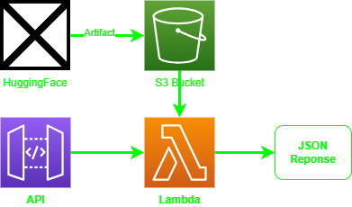

# 🚀 Deploying & Invoking an Imported AWS Bedrock Model

This guide walks you through **downloading a model from Hugging Face**, **uploading it to S3**, **importing it into AWS Bedrock**, **deploying a Lambda function**, **setting up an API Gateway**, and **invoking it using Python and Node.js**.

🚀🚀🚀App is here: [DeepSeek-R1](https://eagle0504-deepseek-r1.hf.space)



---

## 📌 Step 1: Download the Model in SageMaker Notebook

1. **Start an AWS SageMaker Notebook Instance** with at least **100GB** storage and instance type **ml.t3.2xlarge**.
2. **Run the following script** in the notebook to **download the model from Hugging Face**:

   ```python
   ! pip install huggingface_hub boto3
   from huggingface_hub import snapshot_download
   import boto3
   import os

   %%time

   model_id = "deepseek-ai/DeepSeek-R1-Distill-Llama-70B"
   local_dir = snapshot_download(repo_id=model_id, local_dir="DeepSeek-R1-Distill-Llama-70B")
   ```

3. **This will take approximately 1 hour and 40 minutes**.

---

## 📌 Step 2: Upload the Model to S3

Once downloaded, **upload the model to an S3 bucket**:

```python
# Initialize S3 client
s3_client = boto3.client('s3', region_name='us-east-1')

# Define the bucket and directory
bucket_name = 'wyn-associates'
local_directory = "DeepSeek-R1-Distill-Llama-70B"

# Upload model artifacts to S3
for root, dirs, files in os.walk(local_directory):
    for file in files:
        local_path = os.path.join(root, file)
        s3_key = os.path.relpath(local_path, local_directory).replace("\\", "/")
        s3_key = f"models/{s3_key}"

        print(f"Uploading {local_path} to s3://{bucket_name}/{s3_key}")
        s3_client.upload_file(local_path, bucket_name, s3_key)

print("Upload complete.")
```

---

## 📌 Step 3: Import the Model into AWS Bedrock

1. **Go to AWS S3 Console**, find your uploaded model location.
2. **Go to AWS Lambda Console → Imported Models**.
3. Click on **"Jobs"** → **"Create Import Job"**.
4. Enter a **name** and **point to your S3 bucket** where the model is stored.
5. Once the model is imported, test it in the **Playground**.
6. If Playground fails due to runtime constraints, invoke the model manually.

---

## 📌 Step 4: Test Model Invocation Using AWS CLI

Run the following **AWS CLI command** from the AWS Console **terminal**:

```sh
aws bedrock-runtime invoke-model \
--model-id arn:aws:bedrock:us-east-1:141273913934:imported-model/pg6s1qosvls9 \
--body "{\"prompt\":\"tell me a joke\",\"max_gen_len\":512,\"temperature\":0.5,\"top_p\":0.9}" \
--cli-binary-format raw-in-base64-out \
--performance-config-latency standard \
--region us-east-1 \
invoke-model-output.txt
```

Check the output:
```sh
cat invoke-model-output.txt
```

---

## 📌 Step 5: Deploy an AWS Lambda Function

1. **Create an AWS Lambda function** in the AWS Lambda Console.
2. **Paste the following Python script**:

   ```python
   import boto3
   import json

   # Initialize AWS Bedrock Runtime client
   bedrock_runtime = boto3.client("bedrock-runtime", region_name="us-east-1")

   # Model ARN
   MODEL_ARN = "arn:aws:bedrock:us-east-1:141273913934:imported-model/pg6s1qosvls9"

   def lambda_handler(event, context):
       """AWS Lambda function to invoke an imported Bedrock model."""

       print("Received event:", json.dumps(event, indent=2))

       try:
           if isinstance(event.get("body"), str):
               body = json.loads(event["body"])
           else:
               body = event.get("body", {})

           prompt = body.get("prompt", "Tell me a joke.")
           max_gen_len = body.get("max_gen_len", 512)
           temperature = body.get("temperature", 0.5)
           top_p = body.get("top_p", 0.9)

       except (json.JSONDecodeError, TypeError):
           return {"statusCode": 400, "body": json.dumps({"error": "Invalid JSON payload."})}

       model_body = json.dumps({
           "prompt": prompt,
           "max_gen_len": max_gen_len,
           "temperature": temperature,
           "top_p": top_p
       })

       kwargs = {
           "modelId": MODEL_ARN,
           "contentType": "application/json",
           "accept": "application/json",
           "body": model_body
       }

       try:
           resp = bedrock_runtime.invoke_model(**kwargs)
           resp_json = json.loads(resp["body"].read().decode("utf-8"))

           return {"statusCode": 200, "body": json.dumps({"model_response": resp_json})}

       except Exception as e:
           return {"statusCode": 500, "body": json.dumps({"error": str(e)})}
   ```

3. **Deploy the Lambda function**.

---

## 📌 Step 6: Set Up API Gateway

1. **Go to API Gateway** → Create a new **REST API**.
2. **Create a new Resource and Method (POST)**.
3. **Integrate it with the Lambda function**.
4. **Deploy the API** to generate an **Invoke URL**.

---

## 📌 Step 7: Invoke the API Using Python

Save the following script as **`invoke_bedrock.py`**:

```python
import requests
import json

API_URL = "https://zyqnod20re.execute-api.us-east-1.amazonaws.com/dev/test_bedrock_v4_deepseek"

payload = {
    "prompt": "what is 1+1?",
    "max_gen_len": 1024,
    "temperature": 0.5,
    "top_p": 0.9
}

headers = {"Content-Type": "application/json"}

try:
    response = requests.post(API_URL, headers=headers, data=json.dumps(payload))

    if response.status_code == 200:
        full_response = response.json()
        with open("bedrock_response.json", "w") as f:
            json.dump(full_response, f, indent=2)

        output_text = full_response.get("model_response", {}).get("generation", "No output found.")
        print("\nExtracted Output Text:\n", output_text)

    else:
        print(f"Error {response.status_code}: {response.text}")

except requests.exceptions.RequestException as e:
    print(f"Request failed: {e}")
```

Run the script:
```sh
python invoke_bedrock.py
```

---

## 📌 Step 8: Invoke the API Using Node.js

Save the following script as **`invoke_bedrock.js`**:

```javascript
const axios = require("axios");

const API_URL = "https://zyqnod20re.execute-api.us-east-1.amazonaws.com/dev/test_bedrock_v4_deepseek";

const payload = {
    prompt: "what is 1+1?",
    max_gen_len: 1024,
    temperature: 0.5,
    top_p: 0.9
};

axios.post(API_URL, payload, { headers: { "Content-Type": "application/json" } })
    .then(response => {
        console.log("\nExtracted Output Text:\n", response.data.model_response.generation);
    })
    .catch(error => {
        console.error("API Request Failed:", error.response ? error.response.data : error.message);
    });
```

Install dependencies:
```sh
npm install axios
```

Run the script:
```sh
node invoke_bedrock.js
```

---

## 🎯 **Final Thoughts**
Now you have successfully **downloaded**, **uploaded**, **imported**, **deployed**, and **invoked** your AWS Bedrock model via **API Gateway**.

🚀 **Start building with AWS Bedrock today!** 🎉
